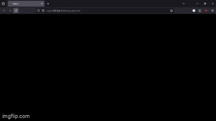

#  **Wake up!**

> “A Matrix está em toda parte. Está à nossa volta. Mesmo agora, nesta sala. Você a vê quando olha pela janela ou quando liga a televisão. Você a sente quando vai trabalhar... quando vai à igreja... quando paga seus impostos. É o mundo que foi colocado diante dos seus olhos para que você não visse a verdade.”  
> — Morpheus

Este é o **meu primeiro projeto pessoal**.  
Um simples efeito visual inspirado na chuva de caracteres do melhor filme ja criado, mas para mim, representa **muito mais do que caracteres verdes** . Representa **o momento em que escolhi acordar**

---

## Em desenvolvimento...

Este projeto ainda está evoluindo. Pretendo:

- Melhorar a performance.
- Adicionar interação com o usuário.
- Explorar novas ideias, reações ao cursos, frases ocultas, back...

Mas, por agora é isso..

---

## Tecnologias usadas

- HTML5
- CSS3
- JavaScript 
- Canvas

---

## Demonstração

---

## Reflexão

Começar é difícil. 
Mas **o primeiro passo é sempre o mais importante**.  
Se você está lendo isso e pensando em começar: **comece hoje.**  
Mesmo que seja simples. Mesmo que ninguém veja.

---

## Até logo... ou até a próxima linha de código.

